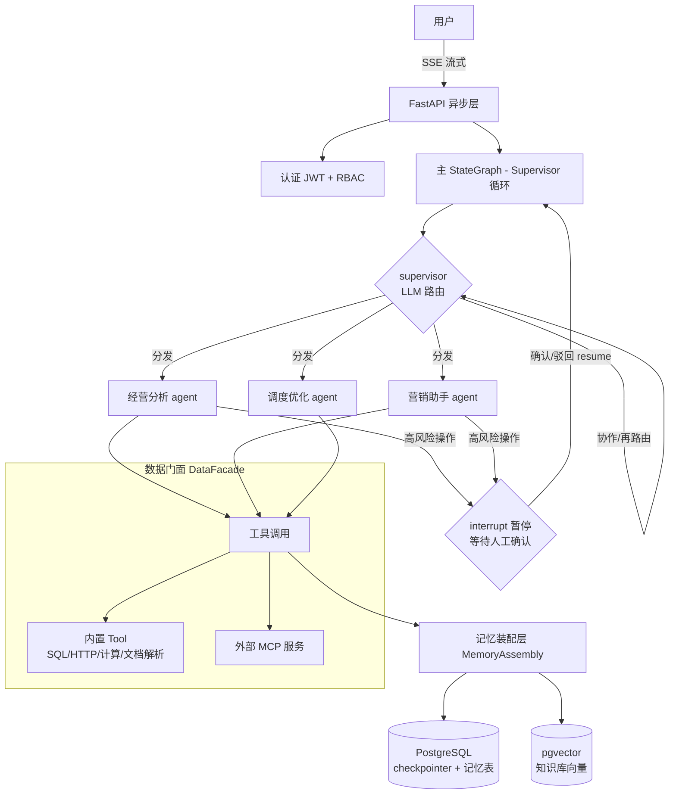
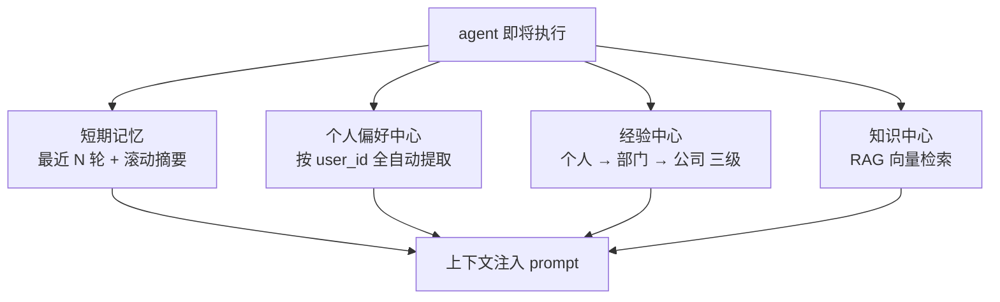
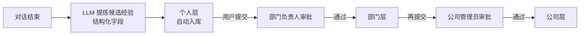
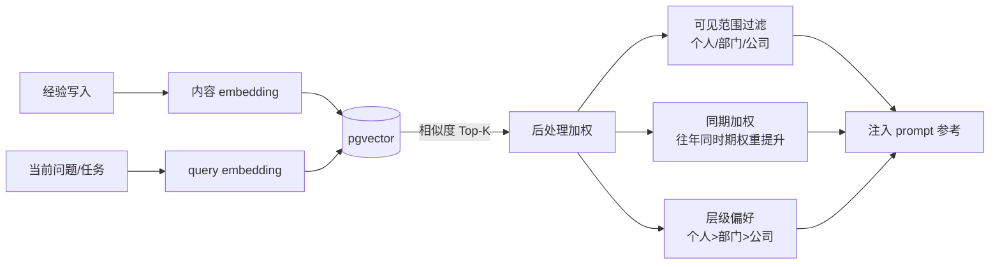
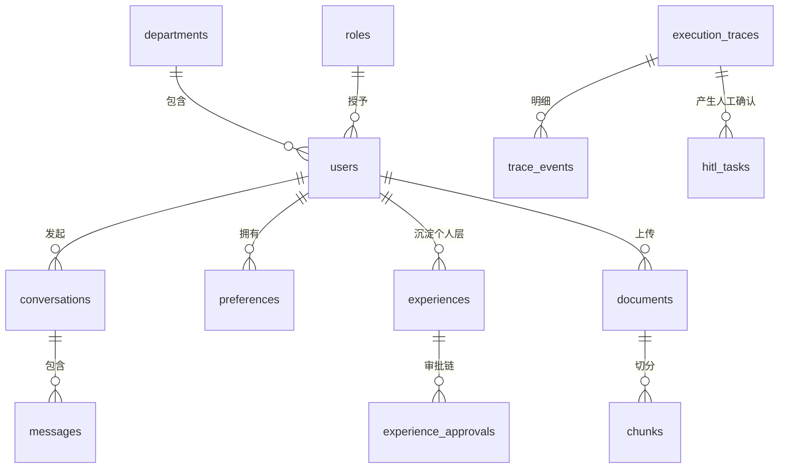
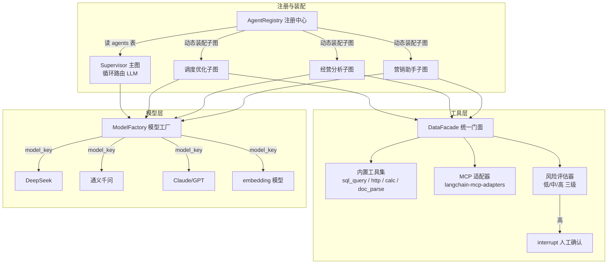

# 多 Agent 智能协作系统设计文档（多层记忆管理）

- **日期**：2026-07-31
- **状态**：已批准，待实现
- **技术栈**：Python 3.11 + LangGraph + PostgreSQL 16 (pgvector) + SQLAlchemy 2.0 (async) + FastAPI（全异步）

---

## 1. 需求概述

构建一个多 Agent 系统，由 **Supervisor** 统一识别用户意图并分发到不同 Agent；系统最核心的能力是**多层记忆管理**：

1. **短期记忆（多轮对话）**：会话上下文持久化，窗口内保留最近 N 轮原文 + 滚动摘要
2. **个人偏好中心**：LLM 全自动提取用户偏好（沟通风格、决策倾向、称呼习惯），按用户隔离
3. **经验中心**：保存历史决策与经营策略，按 **个人 → 部门 → 公司** 三级沉淀，逐级审批晋升
4. **知识中心**：企业知识库（规章制度、操作手册），文档上传 → 切分 → 向量化 → RAG 检索

Agent 运行时**读取多层记忆**，再结合业务数据（内置 Tool / 外部 MCP 统一门面）综合分析给出解答。

### 1.1 关键决策记录

| # | 决策点 | 结论 |
|---|--------|------|
| 1 | 业务形态 | 团队协作平台（多用户），企业使用 |
| 2 | 核心 Agent | 经营分析、营销助手、调度优化（预留可扩展注册机制） |
| 3 | 模型选择 | 多模型可切换（ModelFactory，按 agent/场景配置，OpenAI 兼容） |
| 4 | 知识中心来源 | 文档上传解析（PDF/Word/Markdown），自动切分 + embedding 入库 |
| 5 | 经验中心机制 | 自动沉淀个人层；用户提交 → 部门负责人审批 → 部门层；再提交 → 公司管理员审批 → 公司层 |
| 6 | 组织架构 | 用户 → 部门 → 角色（dept_owner / admin / member）简单模型 |
| 7 | 数据获取 | 内置 Tool + 外部 MCP 双入口，**统一门面**（DataFacade） |
| 8 | 前端形态 | 完整 Web 应用，分三阶段实现（API 一次到位） |
| 9 | 短期记忆策略 | 最近 N 轮全量 + 滚动摘要压缩 |
| 10 | 偏好提取 | 全自动（LLM 识别，相似偏好合并去重） |
| 11 | 认证 | JWT 账号密码，预留 SSO（LDAP/OAuth2）扩展点 |
| 12 | 编排架构 | **方案 B：LangGraph Supervisor 循环路由** |
| 13 | 高风险操作 | Human-in-the-loop：LangGraph `interrupt()` 暂停，人工确认后恢复 |
| 14 | 全链路留痕 | 每一步 LLM 调用/工具操作/路由决策留痕，可人工监测，**不阻塞主流程** |
| 15 | 经验检索 | 纯向量语义检索（pgvector）+ 后处理（可见范围过滤 + 同期加权 + 层级偏好） |

---

## 2. 总体架构

### 2.1 架构图



### 2.2 核心流程

1. 请求经 FastAPI（全异步 + SSE 流式输出）进入 LangGraph 主图
2. **Supervisor 循环路由**：LLM 结构化输出路由决策 `{agent, reason, confidence}`，派给目标 agent → agent 返回结果 → supervisor 判断完成 / 需要协作 / 需要换 agent
3. **记忆装配层（MemoryAssembly）**：每次 agent 执行前统一装配四层记忆 → 短期摘要 + 个人偏好 + 经验检索 + 知识检索 → 注入 prompt
4. **HITL**：agent 触发高风险工具时 `interrupt()` 暂停图执行，checkpoint 持久化；审批状态写入 `hitl_tasks`，前端确认/驳回后 `Command(resume=...)` 恢复执行
5. **全链路留痕**：路由决策、LLM 调用、工具调用、记忆读取、HITL 事件全部留痕（见 2.3）

### 2.3 全链路留痕（Execution Trace）

**目标**：模型每一步调用了什么、返回了什么、做了什么操作，都要留痕，供人工监测。**硬约束：不影响主流程。**

#### 设计要点

1. **事件模型**（每次请求生成 `trace_id` 贯穿全链路）：
   - `route_decision`：supervisor 路由选择、理由、置信度
   - `llm_call`：模型名、输入/输出（全文或截断摘要）、token 数、耗时
   - `tool_call`：工具名、参数、结果、风险等级、耗时
   - `memory_read`：读到了哪些记忆（短期/偏好/经验/知识）、命中内容
   - `hitl_event`：暂停原因、审批人、确认/驳回结果
2. **采集方式**：LangGraph `AsyncCallbackHandler`（捕获 LLM/工具回调）+ 节点包装器（记录节点输入输出与路由决策）
3. **零阻塞保障**：
   - 图执行期间事件只做**内存级推送**（append 到 `asyncio.Queue`），不等待数据库写
   - 独立后台 writer 任务消费队列，**批量 INSERT** 到 `trace_events`，与图执行并行
   - 失败降级：写入失败/队列积压时丢弃积压事件并记录告警日志——**业务可继续，trace 可丢失**
4. **审计约束**：事件只追加不删除；敏感操作（风险工具、审批）强制保留全量参数与结果
5. **监测入口**：查询 API（按 trace_id / 用户 / 时间 / 事件类型过滤）+ 管理端时间线面板

---

## 3. 多层记忆设计（系统核心）

### 3.1 四层记忆总览

| 层 | 内容 | 存储方式 | 读写时机 |
|---|---|---|---|
| **短期记忆** | 多轮对话原文 + 滚动摘要 | `conversations` + `messages` 表 | 每轮写入；装配时取最近 N 轮 + 摘要 |
| **偏好中心** | 沟通风格、决策倾向、称呼习惯 | `preferences` 表（JSONB） | 对话中 LLM 自动提取，相似偏好合并去重 |
| **经验中心** | 决策、策略、教训（三级） | `experiences` 表（scope + 审批状态 + 向量） | 对话结束提炼入个人层；审批通过向上晋升 |
| **知识中心** | 制度、手册、企业知识 | `documents` + `chunks`（pgvector） | 上传时入库；装配时 RAG 检索 |

### 3.2 记忆装配流程



### 3.3 短期记忆（Short-term）

- 会话表持久化全部消息；装配时取**最近 N 轮原文 + 早前滚动摘要**
- 超出窗口触发 LLM 滚动摘要压缩（`conversations.summary` 字段），摘要随新对话滚动更新
- checkpoint 由 `langgraph-checkpoint-postgres` 持久化到 PostgreSQL

### 3.4 个人偏好中心（Preferences）

- LLM 在对话中自动识别偏好（分类：style 沟通风格 / decision 决策倾向 / habit 习惯），写入 `preferences` 表
- 写入前做**相似偏好合并去重**（相同 category + 语义相近内容合并，更新 confidence）
- 用户不可见不可改（决策 #10），但保留 `source` 字段追溯提取来源

### 3.5 经验中心（Experiences）——三级晋升流



- **经验结构化字段**：`title` / `summary`（注入用要点）/ `content`（完整决策过程）/ `tags` / `scope`（personal/dept/company）/ `status`（draft/pending/approved/rejected）/ `event_time`（事件发生时间）/ `result_metrics`（效果复盘 JSON，如 `{"gmv": 320万, "roi": 3.2}`）/ `source_trace_id`（溯源）/ `embedding`
- **效果复盘强制**：营销/策略类经验必须包含「执行时间 + 效果复盘」才能入库，保证"看往年效果"可用
- **晋升审批**：`experience_approvals` 表记录每次晋升链（from_scope → to_scope、审批人、状态、意见），全程可审计
- **检索时**按 `个人 → 部门 → 公司` 优先级召回

### 3.6 经验中心读取机制（简化版向量检索）



- **写入**：经验提炼为结构化条目 → 内容 embedding → 存 pgvector
- **读取**：当前问题 query embedding → 相似度召回 Top-K（默认 5）→ 后处理（可见范围过滤 + 同期加权）→ 注入 prompt
- `tags` 仅作展示元数据和管理端筛选，**不参与检索**
- **场景验证（国庆营销方案）**：用户提问 → 经验检索（"国庆 营销"语义 + 10 月同期加权）召回往年国庆营销经验（含效果）→ SQL Tool 查往年销售数据 → 综合分析生成方案 → 高风险（如大额投放）触发 HITL → 全链路留痕

### 3.7 知识中心（Knowledge）——RAG

- 文档上传 → 解析（PDF/Word/Markdown）→ 切分 chunk → embedding → 存 `chunks`（pgvector）
- 装配时按当前问题语义检索 top-k chunk，注入 prompt 并引用来源文档，支持溯源
- 文档状态流转：`parsing → ready / failed`；失败可重试

---

## 4. 数据库设计

技术底座：PostgreSQL 16 + pgvector，SQLAlchemy 2.0 异步（asyncpg），JSONB 存结构化详情，向量列用 HNSW 索引。

### 4.1 ER 图



### 4.2 核心表

| 表 | 关键字段 | 说明 |
|---|---|---|
| `users` | id, username UK, password_hash, department_id FK, role_id FK, display_name | 用户 |
| `departments` | id, name UK, owner_id FK（负责人） | 部门 |
| `roles` | id, code UK（dept_owner/admin/member） | 角色 |
| `conversations` | id UUID, user_id FK, title, summary（滚动摘要）, current_trace_id, created_at | 会话 |
| `messages` | id, conversation_id FK, role, content, metadata JSONB, created_at | 消息 |
| `preferences` | id, user_id FK, category, content, confidence, source, created_at | 偏好 |
| `experiences` | id UUID, owner_id FK, scope, status, title, summary, content, tags[], event_time, result_metrics JSONB, department_id FK, source_trace_id, created_at, embedding | 经验（含向量） |
| `experience_approvals` | id UUID, experience_id FK, from_scope, to_scope, approver_id FK, status, comment, decided_at | 经验晋升审批 |
| `documents` | id UUID, title, file_path, status, uploader_id FK, department_id FK, created_at | 知识文档 |
| `chunks` | id UUID, document_id FK, seq, content, meta JSONB, embedding | 知识切块（向量） |
| `execution_traces` | id UUID, user_id FK, conversation_id FK, status, supervisor_routes, started_at | 执行轨迹汇总 |
| `trace_events` | id, trace_id FK, type（route/llm/tool/memory/hitl）, payload JSONB, created_at | 留痕事件明细（只追加） |
| `hitl_tasks` | id UUID, trace_id FK, node_id, reason, context JSONB, status, approver_id FK, decided_at | 人工确认任务 |
| `agents` | code PK, name, description, model_key, config JSONB（提示词/工具白名单）, enabled | Agent 注册表 |
| `mcp_servers` | name PK, url, auth_type, config JSONB, enabled | 外部 MCP 配置表 |

### 4.3 核心设计决策

1. **向量统一 pgvector**：经验与知识 chunk 同库存储，避免独立向量库（简化运维）
2. **经验审批独立表**：每次晋升一条记录，支持审计追溯
3. **HITL 与 trace 关联**：`interrupt()` 时写入待确认任务，确认后 resume
4. **agents + mcp_servers 均为配置表**：新 agent / 新 MCP 接入 = 插入记录，不改代码
5. **不使用物理外键**：数据库层不建 FOREIGN KEY 约束（避免锁竞争、迁移灵活、允许临时不一致）；关联列用普通列 + `relationship(foreign_keys=...)` 保持 ORM 关联能力（join / selectinload 预加载照常可用），级联删除由 ORM `cascade` 保证。§4.2 表中"FK"字样均指逻辑外键。

---

## 5. Agent 与工具层

### 5.1 结构图



### 5.2 设计要点

1. **Agent 动态注册**：每个 agent = LangGraph 子图 + `agents` 表配置（系统提示词、模型 key、工具白名单）。新增 agent = 写子图文件 + 插入配置记录，主图不改
2. **Supervisor 循环路由**：官方 supervisor 模式，结构化输出 `{agent, reason, confidence}`，决策写入留痕；支持多 agent 协作链
3. **DataFacade 统一门面**：内置工具集与外部 MCP 服务统一为 Tool 接口，agent 只认工具名；工具按 agent 白名单授权
4. **风险分级 + HITL**：工具声明风险等级（低=查询 / 中=写操作 / 高=资金、删除、外发等）；高风险工具执行前 `interrupt()` 暂停，生成 `hitl_tasks`，人工确认后 resume
5. **多模型切换**：`ModelFactory` 按 `model_key` 实例化模型（LLM 与 embedding 独立配置），供应商走 OpenAI 兼容接口统一适配

---

## 6. API 接口与前端模块

### 6.1 API 总览（FastAPI，全部异步）

| 模块 | 接口 | 说明 |
|---|---|---|
| 认证 | POST /api/auth/register、/api/auth/login、GET /api/auth/me | JWT，预留 SSO 扩展点 |
| 聊天 | POST /api/chat/completions（SSE 流式）、GET/POST /api/conversations、GET /api/conversations/{id}/messages | 流式输出 + 会话历史 |
| HITL 审批 | GET /api/hitl/tasks（我的待办）、POST /api/hitl/tasks/{id}/approve、/reject | 高风险操作人工确认 |
| 知识库 | POST /api/documents（上传）、GET /api/documents、DELETE /api/documents/{id}、GET /api/documents/{id}/chunks、POST /api/kb/search | 上传→解析→切分→embedding 全流程 |
| 经验中心 | GET /api/experiences（分层视图）、POST /api/experiences/{id}/submit、GET /api/approvals、POST /api/approvals/{id}/decide | 三级沉淀 + 审批流 |
| 组织架构 | GET/POST /api/users、/api/departments、/api/roles（管理端） | 用户/部门/角色维护 |
| 监测 | GET /api/traces、GET /api/traces/{trace_id}、GET /api/traces/{trace_id}/events | 全链路留痕查询 |
| 配置管理 | GET/POST /api/agents、/api/mcp-servers、/api/models（管理端） | agent/MCP/模型配置 |

### 6.2 前端模块（分三阶段，后端 API 一次到位）

- **阶段 1（核心可用）**：登录 → 聊天界面（SSE 流式 + 会话列表）+ HITL 审批浮层
- **阶段 2（记忆运营）**：知识库管理（上传/检索测试）+ 经验中心（分层浏览/提交审批/审批处理）
- **阶段 3（管理与监测）**：组织架构管理 + agent/MCP 配置 + 监测时间线面板

前端技术：Vue 3 + Vite + TypeScript，SSE 原生流式读取，组件库 Ant Design Vue。

---

## 7. 项目结构与技术决策

### 7.1 目录结构

```
yunshu-agent-2/
├── backend/
│   ├── app/
│   │   ├── main.py                 # FastAPI 入口（全异步）
│   │   ├── api/                    # 路由层：auth/chat/hitl/documents/
│   │   │                           #   experiences/approvals/org/traces/configs
│   │   ├── core/                   # 配置、安全(JWT)、日志
│   │   ├── agents/                 # LangGraph 图
│   │   │   ├── graph.py            # 主图装配（Supervisor 循环）
│   │   │   ├── supervisor.py       # 路由节点（结构化输出）
│   │   │   ├── registry.py         # AgentRegistry（读 agents 表动态装配）
│   │   │   ├── marketing/          # 营销助手子图
│   │   │   ├── sales_analysis/     # 经营分析子图
│   │   │   └── scheduling/         # 调度优化子图
│   │   ├── memory/                 # 四层记忆
│   │   │   ├── assembly.py         # MemoryAssembly 统一装配
│   │   │   ├── short_term.py       # 短期（最近N轮+滚动摘要）
│   │   │   ├── preferences.py      # 偏好（自动提取+合并去重）
│   │   │   ├── experiences.py      # 经验（三级+审批+向量检索）
│   │   │   └── knowledge.py        # 知识（文档解析+RAG）
│   │   ├── tools/
│   │   │   ├── facade.py           # DataFacade 统一门面
│   │   │   ├── builtin/            # 内置工具（sql/http/calc/doc_parse）
│   │   │   ├── risk.py             # 风险评估器（触发 HITL）
│   │   │   └── mcp_adapter.py      # 外部 MCP 接入
│   │   ├── traces/                 # 全链路留痕采集器
│   │   ├── models/ + schemas/      # SQLAlchemy + Pydantic
│   │   └── services/               # 业务服务（审批流/文档解析等）
│   ├── alembic/                    # 数据库迁移
│   ├── tests/
│   ├── pyproject.toml
│   └── docker-compose.yml
├── frontend/                       # Vue3 + Vite + TS（分三阶段）
└── docs/
```

### 7.2 关键技术决策汇总

| 项 | 决策 |
|---|---|
| 全异步 | FastAPI + SQLAlchemy 2.0 async（asyncpg）+ LangGraph async API，全链路无阻塞 |
| 状态持久化 | `langgraph-checkpoint-postgres` 存会话 checkpoint，支撑中断/恢复/HITL |
| 向量检索 | pgvector（HNSW 索引），经验 + 知识同库 |
| 多模型 | ModelFactory 统一工厂，LLM/embedding 独立配置，OpenAI 兼容适配 |
| 留痕 | AsyncCallbackHandler + 节点包装器 → asyncio.Queue → 后台批量落库，零阻塞主流程 |
| HITL | LangGraph `interrupt()` + `hitl_tasks` 表 + 前端审批 |
| 数据库迁移 | Alembic |
| 部署 | Docker Compose：postgres/pgvector 镜像 + 后端服务，前端独立容器 |

---

## 8. 范围与成功标准

### 8.1 范围（本规格覆盖）

- 后端全量：认证、聊天、四层记忆、Supervisor 路由、三个核心 agent、工具门面、留痕、HITL、全部管理 API
- 前端三阶段：阶段 1 核心可用 → 阶段 2 记忆运营 → 阶段 3 管理与监测
- 文档解析支持 PDF / Word / Markdown
- 组织架构：用户、部门、角色简单模型（不含完整 OA 同步）

### 8.2 成功标准

1. 用户提问 → supervisor 正确路由 → agent 结合四层记忆与业务数据给出解答
2. 国庆营销场景端到端可用：经验检索召回往年同期策略（含效果）→ 数据佐证 → 方案生成 → 高风险审批 → 全链路可回放
3. 经验三级晋升审批流完整（个人 → 部门 → 公司）
4. 全链路留痕不阻塞主流程（写入失败业务不受影响）
5. HITL 中断/恢复不丢状态（checkpoint 持久化）
6. 新增 agent / MCP 服务无需改主图代码

### 8.3 明确不做的（YAGNI）

- 完整 OA / AD 组织架构同步（预留 SSO 扩展点但不实现）
- 多租户 SaaS 化
- 独立向量数据库（如 Milvus）
- 复杂多级审批流（超过两级：部门 → 公司）
